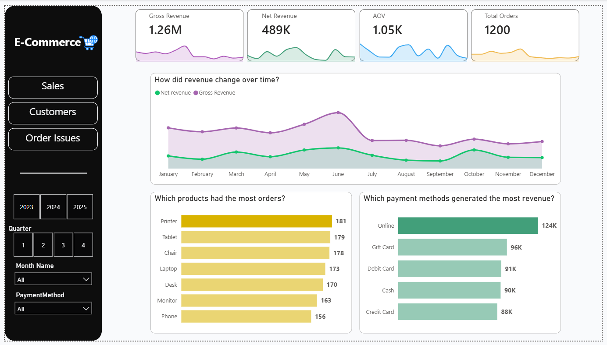
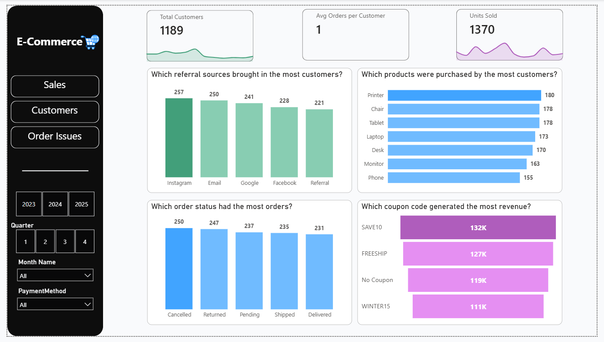
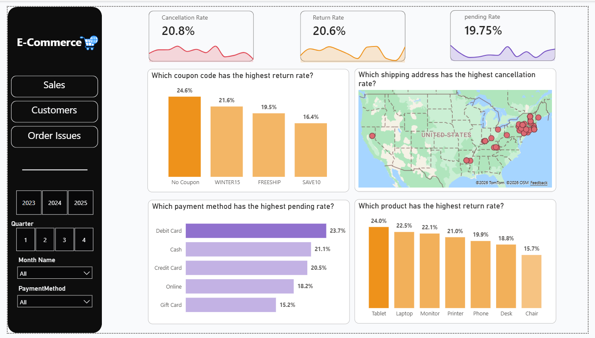

# E-Commerce Analytics

An end-to-end data analysis project covering data cleaning, exploratory analysis, SQL querying, and an interactive Power BI dashboard.

## Data source & disclaimer

The dataset (1,200 order records) is a **synthetic/practice dataset used for portfolio purposes — not real company data.** Any business conclusions below describe patterns *within this sample* and should not be read as findings about an actual business.

## Pipeline Diagram

```
Excel (raw data, 1200 rows)
      ↓
Python / pandas — cleaning, validation, exploratory analysis
      ↓
SQL Server — deeper querying and aggregation
      ↓
Power BI — Power Query (Date table), DAX measures, interactive dashboard
```

## Data Model


## Data cleaning (Python)

- Verified `OrderID` uniqueness and checked for duplicate rows — none found.
- Checked for missing values across all columns; only `CouponCode` had nulls, which were replaced with `"No Coupon"`.
- Inspected `Quantity`, `UnitPrice`, `ItemsInCart`, and `TotalPrice` for outliers via boxplots.
- Flagged high-value `TotalPrice` outliers for review rather than removing them outright (see Notes & limitations below).
- Exported the cleaned dataset for SQL analysis.

## Deeper analysis (SQL Server)

Queries covered: order uniqueness, total/unique customers, orders per customer, units sold per product, orders per product, orders per payment method, top cancelled/returned product, customers by referral source, Gross Revenue, Net Revenue, AOV, Cancellation Rate, and cancellation/return counts per customer.

## Dashboard (Power BI)

Three-page interactive dashboard, all pages sharing filters for **Year**, **Quarter**, **Month**, and **Payment Method**. Built with a separate Date table (created in Power Query) and custom DAX measures for revenue, AOV, and cancellation/return/pending rates.

**Page 1 — Sales**
- KPI cards: Gross Revenue, Net Revenue, AOV, Total Orders
- Line chart comparing Gross vs. Net revenue trend across all 12 months
- Bar chart: order count by product
- Bar chart: revenue by payment method



**Page 2 — Customers**
- KPI cards: Total Customers, Avg Orders per Customer, Units Sold
- Bar chart: customer count by referral source (Instagram, Email, Google, Facebook, Referral)
- Bar chart: products purchased by the most distinct customers
- Bar chart: order count by order status (Cancelled, Returned, Pending, Shipped, Delivered)
- Bar chart: revenue by coupon code



**Page 3 — Order Issues**
- KPI cards: Cancellation Rate, Return Rate, Pending Rate
- Bar chart: return rate by coupon code
- Map: cancellation rate by shipping address (US)
- Bar chart: pending rate by payment method
- Bar chart: return rate by product



## Key insights

- `OrderID` is unique across all 1,200 rows; the dataset covers **1,189 unique customers**.
- **Printer** has the most orders overall; **Chair** is most often ordered in larger quantities per cart.
- **Phone** is the lowest performer on both orders and quantity.
- **Online** payment brings in the most revenue and is the most used method; **Credit Card** brings in the least.
- No single customer repeatedly cancels or returns orders — cancellations/returns are spread across the customer base.
- **Tablet** has the highest return rate; **Chair** has the highest cancellation rate.
- **June** is the strongest month for both revenue and order volume; **September** and **August** are the weakest.
- **SAVE10** and **FREESHIP** generate the most revenue among coupon codes; **No Coupon** and **WINTER15** trail behind.
- **August** and **April** see the most cancellations; **September** and **December** see the fewest.
- (Python) The shipping address **"533 Main St"** appears most frequently (8 orders).
- (Python) Order status breakdown: 250 cancelled, 247 returned, 237 pending, 468 shipped/delivered (the last group counted toward revenue).
- (Python) A number of high `TotalPrice` outliers overlap with cancelled/returned orders — representing a notable revenue loss.

## Recommendations

*(Framed as if this were real business data — for demonstration of analytical thinking.)*

- Review **Credit Card** as a payment option — lowest revenue contribution despite being offered — investigate fees or friction in that checkout path.
- Investigate **Tablet** quality/description accuracy given the highest return rate.
- Investigate **Chair** listing/fulfillment given the highest cancellation rate.
- Use the **August/April cancellation spike** as a starting point to check for seasonal, shipping, or promotional causes in those months.

## Notes & limitations

- High `TotalPrice` outliers were validated by checking `Quantity × UnitPrice` against `TotalPrice` rather than removed — they appear to be legitimate large orders, not data-entry errors.
- Dataset origin is a practice/sample source, not verified real-world transaction data (see disclaimer above).

## Tools

Python (pandas, matplotlib), SQL Server, Power BI (Power Query, DAX).
